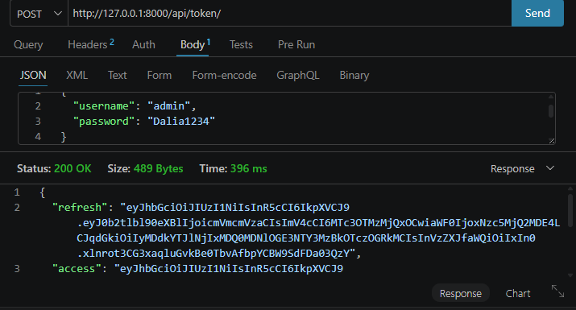
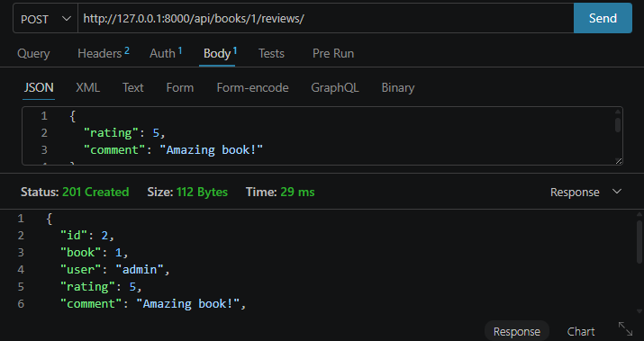

# Book Review API

A RESTful API built with Django REST Framework for a book review system.

## Features

- User registration
- JWT login and token refresh
- List books
- View book details
- Admin-only book creation, update, and delete
- Add reviews to books
- View reviews for a specific book
- Edit and delete own reviews
- Change password

## Technologies Used

- Python 3
- Django
- Django REST Framework
- djangorestframework-simplejwt
- SQLite3

## Installation

1. Clone the repository:

```bash
git clone YOUR_REPOSITORY_LINK
cd book-review-api

Create and activate virtual environment:
python -m venv venv
venv\Scripts\activate
--------------------------------------------
Install requirements:
pip install -r requirements.txt
-----------------------------------
Apply migrations:
python manage.py migrate
----------------------------------------
Create superuser:
python manage.py createsuperuser
------------------------------------
Run server:
python manage.py runserver
-------------------------------------------
Authentication
This project uses JWT Authentication.
To login and get tokens:

POST /api/token/

Body:

{
  "username": "admin",
  "password": "your_password"
}

The response returns:

{
  "refresh": "refresh_token",
  "access": "access_token"
}

----------------------------------------------------
Use the access token in protected requests:

Authorization: Bearer access_token

---------------------------------------------

Testing with Thunder Client or Postman
Login

Method:

POST

URL:

http://127.0.0.1:8000/api/token/

Body:

{
  "username": "admin",
  "password": "your_password"
}
Add Review

Method:

POST

URL:

http://127.0.0.1:8000/api/books/1/reviews/

Authorization:

Bearer Token

Body:

{
  "rating": 5,
  "comment": "Amazing book!"
}

Expected response:

{
  "id": 1,
  "book": 1,
  "user": "admin",
  "rating": 5,
  "comment": "Amazing book!",
  "created_at": "date"
}

## Screenshots

### JWT Login



### Add Review



Models
Book
title
author
description
Review
book
user
rating
comment
created_at


***********************************
## Project Structure

book-review-api/
│
├── book_review_api/
├── reviews/
├── screenshots/
├── requirements.txt
├── README.md
├── manage.py

## Permissions

- Public users can view books and reviews.
- Only authenticated users can add reviews.
- Users can only edit or delete their own reviews.
- Only admin users can manage books.